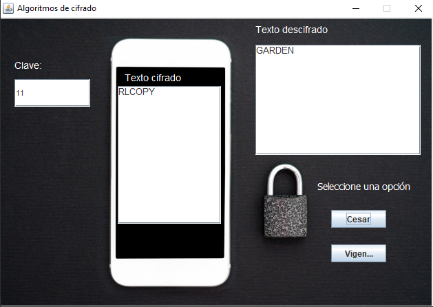
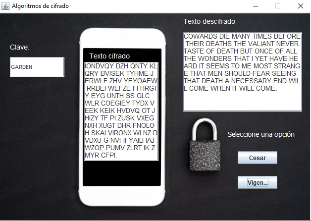

# Técnicas de pruebas de software - Práctica Cifrado

## Cifrado Cesar

## Cifrado Vigenère

La empresa Todomé Rob-Ann y Asociados ha sido recientemente atacada por un grupo de hackers extremistas. La empresa no perdió la información, sólo se encriptó de tal forma que los hackers piden dinero para desencriptarla por lo que te ha contratado a ti para que trates de descifrar la información y no tengan que pagar a los hackers.

La empresa te dará dos archivos ([diccionario.txt](diccionario.txt) y [encriptado.txt](encriptado.txt)). Se sabe que al grupo de hackers le gusta utilizar dos tipos de algoritmos de cifrado:

- César
- Vigenère

La empresa en primera instancia desea que descifres la información. Sin embargo, está consciente que puede ser atacada nuevamente por lo que ha decidido tener el código de los programas para usarlos nuevamente si es necesario. Lo que te pide es lo siguiente:

1. Crear un programa con interfaz de usuario que permita el descifrado del mensaje
2. Crear las pruebas necesarias mediante Appium para determinar el buen funcionamiento de su solución
3. Escribir un reporte de práctica donde explique el proceso de las pruebas
